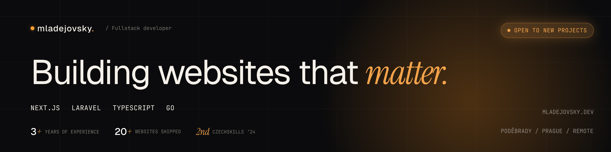

###

### 🎯 Fullstack developer building web apps for SMBs and agencies.

- 🏆 **2nd place at CzechSkills '24** — national web dev championship
- 🚧 Currently: Building a multi-tenant e-commerce SaaS and Laravel client work
- 🌍 Based in Czech Republic — open to remote work worldwide
- 💼 **Available for freelance projects** — [mladejovsky.dev](https://mladejovsky.dev)

###

<h2 align="left">I code with</h2>

###

  
  
  
  
  
  
  
  
  
  
  
  
  
  
  
  
  
  
  
  
  
  
  
  
  
  
  
  
  

###

## 📊 GitHub Stats

## 🌍 Connect with Me
- Portfolio: [mladejovsky.dev](https://mladejovsky.dev)
- LinkedIn: [Tomáš Mladějovský](https://www.linkedin.com/in/mladejovsky/)
- Email: tomas@mladejovsky.dev